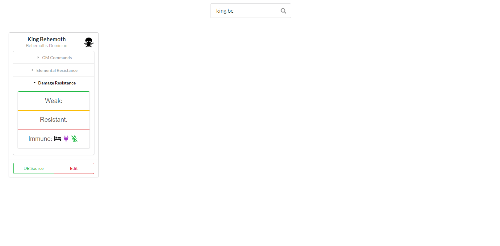

## Requirements
* [Node Package Manager](https://www.npmjs.com/get-npm)
* `npm i -g sequelize-cli`

## Setup 

1. `npm install`
2. Create a nodemon.json file like the following
```
{
    "env": {
        "DB_NAME": "YOUR_DB_NAME",
        "DB_USER": "YOUR_DB_USERNAME",
        "DB_PASSWORD": "YOURE_DB_PASSWORD"
    }
}
```
3. Create a db/config/config.json file like the following
```
{
  "development": {
    "username": "YOUR_DB_USERNAME",
    "password": "YOUR_DB_PASSWORD",
    "database": "YOUR_DB_NAME",
    "host": "YOUR_DB_HOST",
    "dialect": "mysql"
  },
  "test": {
    "username": "YOUR_DB_USERNAME",
    "password": "YOUR_DB_PASSWORD",
    "database": "YOUR_DB_NAME",
    "host": "YOUR_DB_HOST",
    "dialect": "mysql"
  },
  "production": {
    "username": "YOUR_DB_USERNAME",
    "password": "YOUR_DB_PASSWORD",
    "database": "YOUR_DB_NAME",
    "host": "YOUR_DB_HOST",
    "dialect": "mysql"
  }
}
```

## Running
1. `npm start`
2. Visit localhost:3000 in your browser

## Screenshots

